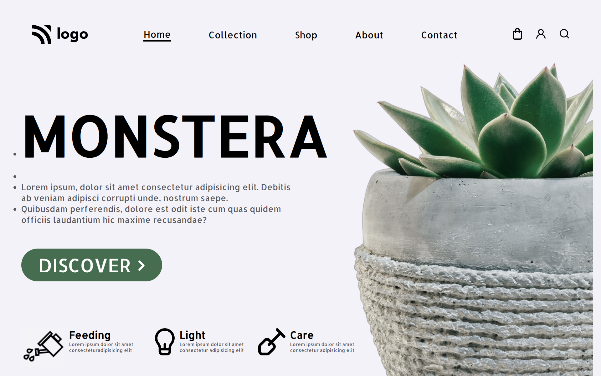

# UI Project 06 - Ecommerce Website Homepage

> ### **Deployed Website** :-[Live Link](https://ui-project-6.netlify.app/)
 

## Project key takeaways:

  - Used Only **Html** and **CSS**
  - I learned a lot about flexbox.
  - I learned to create different cart Buttons using different icons.

   

 

> ## It took around 6 hours to complete and make this project **Mobile** Responsive.
